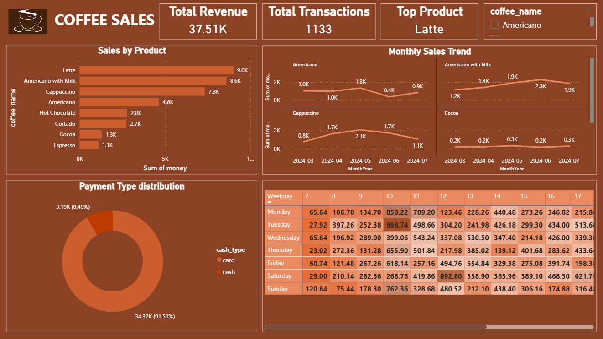

# ☕ Coffee Sales Analysis Project

This project analyzes transactional data from a coffee vending machine, focusing on customer behavior, product performance, and sales trends. The insights are visualized using Python and Power BI to aid in business decision-making such as inventory management and sales forecasting.

---

## 📁 Dataset Overview

- **Source**: Coffee sales from a vending machine
- **Time Period**: March 2024 to July 2024
- **Size**: ~1,100+ transactions
- **Columns**:
  - `date` – Date of transaction
  - `datetime` – Timestamp
  - `cash_type` – Payment method (card or cash)
  - `card` – Card ID (masked)
  - `money` – Amount spent
  - `coffee_name` – Product purchased

---

## 🎯 Objectives

- Analyze top-selling products
- Discover purchase patterns by day, time, and product
- Compare card vs cash transactions
- Identify peak sales hours and days
- Forecast future sales (basic regression model)
- Create a visual Power BI dashboard

---

## 🛠️ Tools Used

| Tool | Purpose |
|------|--------|
| **Python (Pandas, Seaborn, Matplotlib)** | Data cleaning, transformation & visualization |
| **Scikit-learn** | Basic ML model (sales prediction) |
| **Power BI** | Interactive dashboards and business reporting |

---

## 📊 Python Analysis Highlights

- Hourly and weekday sales distribution
- Monthly sales trends per coffee product
- Most popular payment method
- Revenue by product type

---

## 📈 Power BI Dashboard

The final dashboard includes:
- KPIs: Total Revenue, Total Transactions, Top Product
- Slicers: Filter by product
- Charts:
  - Bar: Sales by Product
  - Line(Small multiples): Monthly Sales Trend
  - Donut Pie: Payment Type Distribution
  - Matrix: Weekday Hour Matrix

### 🖼️ Dashboard Preview

> 📌 *Ensure `dashboard1.png` is placed in the project root directory for this preview to appear.*

---

## 🚀 How to Run

1. Clone this repo
2. Open the Jupyter Notebook: `2.coffeeSales.ipynb`
3. Run all cells to reproduce results
4. Optional: Open the `.pbix` Power BI file to view/edit the dashboard

---

## 📚 Project Structure

├── 2.coffeeSales.csv # Raw dataset
├── 2.coffeeSales.ipynb # Jupyter Notebook analysis
├── coffeeSalesDashboard.pbix # Power BI dashboard file
├── dashboard1.png # Dashboard preview image
└── 2.README.md # Project overview

---

## 📌 Credits

Dataset by [Yaroslav Isaienkov](https://www.kaggle.com/ihelon)

---

## ✅ Status

This project is **completed** and serves as a portfolio piece for data analysis and visualization.

