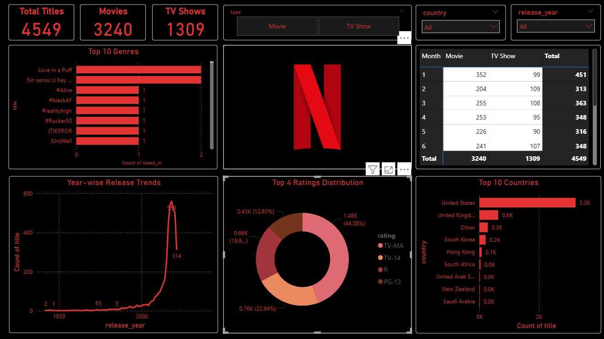

# 🎬 Netflix Data Analysis & Visualization Project

This project explores Netflix's content catalog to uncover trends in content type, ratings, genres, and time-based additions. Using Python and Power BI, the project analyzes patterns across thousands of movies and shows from 1925 to 2021 to derive meaningful insights and present them through visual dashboards.

---

## 📁 Dataset Overview

- **Source**: [Netflix Titles Dataset](https://www.kaggle.com/datasets/shivamb/netflix-shows)
- **Time Period**: 1925 to 2021
- **Size**: ~8,700+ titles
- **Columns**:
  - `show_id` – Unique ID
  - `type` – Movie or TV Show
  - `title` – Name of the content
  - `director`, `cast`, `country` – Metadata
  - `date_added` – Date when content was added to Netflix
  - `release_year` – Year content was originally released
  - `rating` – Age classification
  - `duration` – Duration (minutes or seasons)
  - `listed_in` – Genre/categories

---

## 🎯 Objectives

- Analyze the distribution of content by type and genre
- Examine ratings frequency and content trends over time
- Identify top contributing countries and directors
- Visualize monthly and yearly content additions
- Generate genre-wise insights for both movies and TV shows
- Build an interactive dashboard in Power BI

---

## 🛠️ Tools Used

| Tool | Purpose |
|------|--------|
| **Python (Pandas, Seaborn, Matplotlib, WordCloud)** | Data wrangling, analysis, and visualization |
| **Power BI** | Interactive dashboard and business reporting |

---

## 📊 Python Analysis Highlights

- Movie vs TV Show distribution (count + pie chart)
- Ratings breakdown (bar and pie charts)
- Content addition trend by year and month
- Top 10 content-producing countries
- Most popular genres for both movies and TV shows
- Word Cloud of Netflix titles
- Top 15 directors based on content count

---

## 📈 Power BI Dashboard

The final dashboard includes:
- KPIs: Total Titles, Movies vs TV Shows
- Slicers: Filter by content type, country, year
- Charts:
  - Bar: Top 10 Genres
  - Line: Year-wise release trends
  - Donut Pie: Content Ratings
  - Bar: Top 10 Countries
  - Matrix: Monthly additions by type

### 🖼️ Dashboard Preview

---

## 🚀 How to Run

1. Clone this repo
2. Open the Jupyter Notebook: `NetflixEDA.ipynb`
3. Run all cells to reproduce the analysis
4. Open the `.pbix` file in Power BI to view/edit the dashboard

---

## 📚 Project Structure

├── 4.netflix.csv # Raw dataset
├── 4.netflixEDA.ipynb # Jupyter Notebook with EDA
├── netflixDashboard.pbix # Power BI dashboard file
├── dashboard2.png # Dashboard preview (optional)
└── 4.README.md # Project overview

---

## 🔗 References

- [Kaggle Dataset](https://www.kaggle.com/datasets/shivamb/netflix-shows)
- [GitHub Notebook Reference](https://github.com/Srijan-1-3/Netflix-Data-Analysis)
- [Public Tableau Dashboard](https://public.tableau.com/app/profile/abdulrasaq.ariyo/viz/NetflixTVShowsMovies_16615029026580/NetflixDashboard)

---

## ✅ Status

This project is **completed** and serves as a portfolio piece for data cleaning, EDA, and dashboarding.

